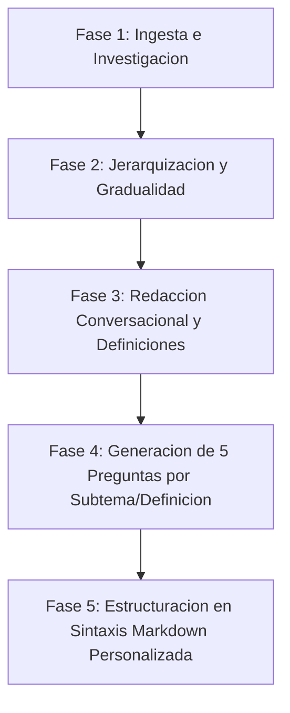

# Skill: Traductor de Temas y Creador de Contenido Pedagógico

Este skill define el protocolo para convertir cualquier tema, temario, texto o archivo fuente en un documento Markdown pedagógico, interactivo y estructurado de acuerdo con la sintaxis y convenciones del proyecto **EstudiosUniversitarios**.

---

## 1. Criterios de Activación

Activar este skill cuando el usuario solicite:
- Procesar, traducir o estructurar un tema a partir de un archivo, apunte, resumen o título.
- Generar un nuevo archivo de contenido en `content/[slug-de-materia]/`.
- Comandos o mensajes que inicien con `[Traductor de Temas]`, `[Traducir Tema]`, `[Crear Tema]` o `[Generar Contenido]`.

---

## 2. Flujo de Trabajo en 5 Fases



---

### Fase 1: Ingesta e Investigación del Tema

1. **Recepción del Input:**
   - Si el usuario proporciona un **archivo fuente o texto**, analizarlo detalladamente para identificar los conceptos clave, fórmulas, teoremas y casos prácticos.
   - Si el usuario proporciona un **título de tema o contenido incompleto**, utilizar herramientas de búsqueda web (`search_web` / `read_url_content`) para investigar la teoría completa, estado del arte, ejemplos reales y preguntas frecuentes.
2. **Definición de Metadatos:**
   - Determinar `especialidad` (ej. `ingenieria-software`), `materia` (ej. `estructuras-de-datos`), `title`, `description`, `tags` y `id` único.

---

### Fase 2: Jerarquización y Gradualidad Pedagógica (De lo Básico a lo Técnico)

Ordenar la información de forma secuencial siguiendo una curva de aprendizaje progresiva:

1. **Nivel 1 (Intuición y Fundamentos):** ¿Qué problema resuelve? Analogía de la vida real, motivación y concepto básico sin jerga innecesaria.
2. **Nivel 2 (Mecanismos y Reglas):** ¿Cómo funciona? Propiedades, sintaxis, operaciones elementales y componentes principales.
3. **Nivel 3 (Profundidad Técnica y Casos de Uso):** Algoritmos, complejidad temporal/espacial, optimizaciones, casos de borde y comparativa con alternativas.
4. **Nivel 4 (Aplicación Práctica / Código):** Ejemplos de implementación reales, patrones de diseño y errores comunes a evitar.

---

### Fase 3: Redacción Conversacional y Definiciones Accesibles

1. **Tono Conversacional:**
   - Redactar como un **mentor o profesor particular experto pero cercano y ameno**.
   - Utilizar preguntas retóricas, explicaciones paso a paso y ejemplos visuales claros.
   - Evitar el lenguaje excesivamente denso o árido sin sacrificar la rigurosidad técnica.
2. **Extracción de Definiciones Clave (`[DEFINICION]`):**
   - Identificar los conceptos y términos técnicos indispensables.
   - Encapsular cada término en un bloque `[DEFINICION nombre="..."]`.
   - Explicar la definición con palabras sencillas y concisas antes de profundizar.

---

### Fase 4: Generación de Reactivos Interactivos (5 Preguntas por Subtema / Definición)

Para cada subtema y bloque de definición relevante, generar exactamente **5 preguntas diferentes y de alto valor pedagógico**:

1. **Tipos de Pregunta Admitidos:**
   - `[PREGUNTA tipo="opcion_multiple"]`: Evalúa comprensión conceptual o elección de la mejor alternativa.
   - `[PREGUNTA tipo="verdadero_falso"]`: Evalúa afirmaciones precisas, trampas conceptuales o mitos comunes.
   - `[PREGUNTA tipo="codigo"]`: Evalúa análisis de fragmentos de código, salidas esperadas o detección de errores.

2. **Estructura Obligatoria de cada Pregunta:**
   - **Enunciado claro:** Pregunta directa o planteamiento de escenario.
   - **Opciones de Respuesta:** Delimitadas por `[RESPUESTA]...[/RESPUESTA]`.
     - Exactamente una opción con `correcta="true"`, por ejemplo: `[RESPUESTA correcta="true"]Opción Correcta[/RESPUESTA]`.
     - 2 o 3 distractores plausibles que reflejen confusiones típicas de estudiantes.
   - **Explicación Pedagógica:** Delimitada por `[EXPLICACION]...[/EXPLICACION]`, detallando el *porqué* de la respuesta correcta y por qué los distractores son incorrectos.

3. **Distribución de las 5 Preguntas:**
   - **Pregunta 1:** Comprensión directa o definición básica.
   - **Pregunta 2:** Aplicación práctica o análisis de caso.
   - **Pregunta 3:** Verdadero o Falso sobre una propiedad o sutileza.
   - **Pregunta 4:** Análisis de código o cálculo/traza.
   - **Pregunta 5:** Escenario de decisión, complejidad o caso de borde (*edge case*).

---

### Fase 5: Estructuración en Sintaxis Markdown Personalizada

Todo archivo resultante debe cumplir con las siguientes especificaciones sintácticas:

#### 1. Frontmatter YAML
```yaml
---
id: "[slug-tema]-[numero]"
title: "Título Descriptivo del Tema"
description: "Resumen conciso del contenido abordado."
especialidad: "[slug-especialidad]"
materia: "[slug-materia]"
order: 1
tags: ["tag1", "tag2", "tag3"]
lastUpdated: "YYYY-MM-DD"
---
```

#### 2. Delimitadores de Bloque
- **Tema Principal:**
  ```markdown
  [TEMA nombre="Nombre del Subtema"]
  ... contenido conversacional, definiciones y preguntas ...
  [/TEMA]
  ```
- **Definición Clave:**
  ```markdown
  [DEFINICION nombre="Término Clave"]
  Explicación accesible y directa del concepto.
  
  [PREGUNTA tipo="opcion_multiple"]
  ...
  [/PREGUNTA]
  [/DEFINICION]
  ```
- **Pregunta Interactiva:**
  ```markdown
  [PREGUNTA tipo="opcion_multiple"]
  ¿Cuál es el propósito principal de...?
  [RESPUESTA correcta="true"]Respuesta correcta explicada con precisión.[/RESPUESTA]
  [RESPUESTA]Distractor plausible 1.[/RESPUESTA]
  [RESPUESTA]Distractor plausible 2.[/RESPUESTA]
  [RESPUESTA]Distractor plausible 3.[/RESPUESTA]
  [EXPLICACION]
  Explicación detallada de por qué es correcta y por qué las demás fallan.
  [/EXPLICACION]
  [/PREGUNTA]
  ```

#### 3. Ubicación del Archivo
- Guardar el archivo generado en `content/[slug-de-materia]/[slug-del-tema].md`.

---

## 3. Lista de Verificación y Control de Calidad

Antes de finalizar la entrega del contenido, verificar:
- [ ] El archivo cuenta con Frontmatter YAML válido.
- [ ] La información fluye desde conceptos intuitivos y básicos hasta implementaciones técnicas avanzadas.
- [ ] El lenguaje es conversacional, amigable y claro.
- [ ] Todos los términos fundamentales están delimitados por `[DEFINICION nombre="..."]`.
- [ ] Cada subtema y definición cuenta con 5 preguntas variadas (`opcion_multiple`, `verdadero_falso`, `codigo`).
- [ ] Todas las preguntas tienen una sola `[RESPUESTA correcta="true"]` y un bloque `[EXPLICACION]` completo.
- [ ] Todas las etiquetas `[TEMA]`, `[DEFINICION]`, `[PREGUNTA]`, `[RESPUESTA]` y `[EXPLICACION]` están correctamente cerradas.
- [ ] No se utilizan emojis en el texto técnico ni en el código.
