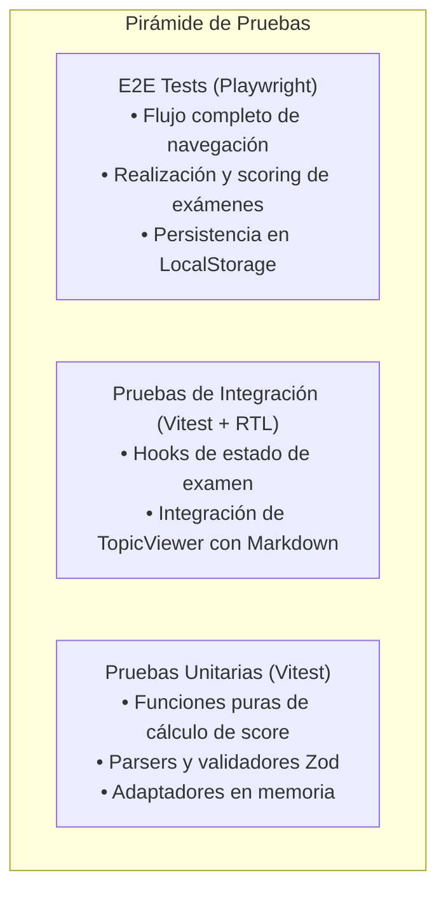

# AGENTS.md - Reglas y Estándares del Proyecto EstudiosUniversitarios

Este documento define las directrices obligatorias de arquitectura, diseño de software (SOLID, DRY), estándares de estilos, estrategias de pruebas (Unitarias y E2E), y el enlace a las Skills mandatorias para garantizar la máxima calidad y mantenibilidad del código, facilitando el desarrollo colaborativo entre humanos y agentes de Inteligencia Artificial.

---

## 1. Skills y Protocolos de Desarrollo Mandatorios

Todo agente de IA o desarrollador que participe en este repositorio debe seguir obligatoriamente las siguientes skills estandarizadas:

1. **[Skill: Desarrollo Modular (.agent/skills/desarrollo-modular/SKILL.md)](file:///e:/Proyectos/ZoeAndyDev/EstudiosUniversitarios/.agent/skills/desarrollo-modular/SKILL.md)**
   - **Activación:** Obligatoria al implementar cualquier nueva funcionalidad, nuevo componente, módulo o refactorización.
   - **Protocolo de 5 Fases:**
     - *Fase 1:* Contratos de Tipos y Modelo de Dominio (Type-First, sin `any`, pausas de control).
     - *Fase 2:* Descomposición Arquitectónica y SRP (Lógica pura, hooks desacoplados, componentes visuales < 200 líneas).
     - *Fase 3:* Plan de Implementación formal (`implementation_plan.md`).
     - *Fase 4:* Construcción Modular con JSDoc y sin emojis.
     - *Fase 5:* Verificación Estática (`pnpm tsc --noEmit`) y cierre (`walkthrough.md`).

2. **[Skill: Corrección de Errores (.agent/skills/correccion-de-errores/SKILL.md)](file:///e:/Proyectos/ZoeAndyDev/EstudiosUniversitarios/.agent/skills/correccion-de-errores/SKILL.md)**
   - **Activación:** Obligatoria ante cualquier reporte de bug o error en el sistema.

3. **[Skill: Traductor de Temas (.agent/skills/traductor-de-temas/SKILL.md)](file:///e:/Proyectos/ZoeAndyDev/EstudiosUniversitarios/.agent/skills/traductor-de-temas/SKILL.md)**
   - **Activación:** Obligatoria al procesar, investigar, estructurar o redactar nuevos temas de aprendizaje y evaluaciones interactivas bajo la convención Markdown personalizada del proyecto.

---

## 2. Principios de Arquitectura

### 2.1. Feature-Driven & Vertical Slice Architecture
- Todo el código de negocio se organiza dentro de `src/features/<feature_name>/`.
- Cada *feature* es autónoma y debe agrupar:
  - `components/`: Componentes UI específicos de la feature junto a sus estilos `.module.css`.
  - `hooks/`: Lógica de estado y controladores de la feature.
  - `types/`: Tipos TypeScript específicos.
  - `utils/` o `services/`: Funciones puras de cálculo, validación o transformación.
  - `__tests__/`: Pruebas unitarias correspondientes a la feature.
- El código común o transversal reside exclusivamente en `src/shared/` (`components`, `lib`, `styles`, `types`).

### 2.2. Arquitectura Hexagonal (Ports & Adapters)
- **Desacoplamiento de Datos:** La lógica del dominio (ej. evaluación de exámenes, cálculo de progreso) no debe invocar directamente APIs del navegador (`window.localStorage`) ni APIs externas.
- **Puertos (Interfaces):** Definir interfaces explícitas (ej. `IProgressRepository`, `IContentProvider`).
- **Adaptadores:** Implementar adaptadores específicos (`LocalStorageProgressRepository`, `FileSystemContentProvider`, `MemoryProgressRepository` para tests).

---

## 3. Fundamentos SOLID y DRY

### 3.1. Single Responsibility Principle (SRP)
- **Separación UI y Lógica:** Los componentes de React deben ser exclusivamente de presentación o contenedores orquestadores.
- Funciones de cálculo (puntuación de examen, formateo de tiempo, parsing de Markdown) deben ser **funciones puras** fuera de los componentes.

### 3.2. Open / Closed Principle (OCP)
- El sistema debe ser extensible sin modificar el código base existente.
- Ejemplo: El motor de preguntas de examen utiliza un patrón *Factory/Registry* para renderizar reactivos (`MultipleChoiceQuestion`, `CodeSnippetQuestion`, `TrueFalseQuestion`). Agregar un nuevo tipo de reactivo no altera el componente `ExamEngine`.

### 3.3. Liskov Substitution Principle (LSP)
- Todos los adaptadores de almacenamiento o proveedores de contenido deben cumplir exactamente con su interfaz base sin arrojar errores inesperados ni cambiar firmas de métodos.

### 3.4. Interface Segregation Principle (ISP)
- Crear interfaces pequeñas, atómicas y cohesivas (`IReadableTopic`, `IExamEvaluator`, `ITimerController`) en lugar de interfaces gigantes con propiedades no utilizadas.

### 3.5. Dependency Inversion Principle (DIP)
- Los componentes y hooks deben depender de abstracciones (interfaces), inyectadas mediante contextos de React o parámetros de función.

### 3.6. DRY (Don't Repeat Yourself) & AHA (Avoid Hasty Abstractions)
- Centralizar constantes de rutas, esquemas de validación Zod y tokens de diseño CSS.
- Seguir la **Regla de Tres (Rule of Three)**: no abstraer código al primer o segundo uso idéntico; abstraer únicamente cuando el patrón se repita tres veces.

---

## 4. Estándares de UI y Estilos (CSS Modules)

- **Regla Estricta:** Prohibido importar o utilizar frameworks CSS externos (Tailwind CSS, MUI, Chakra, Bootstrap, etc.).
- **CSS Modules Obligatorio:** Todos los estilos deben ser `.module.css` asociados directamente a su componente (`Header.tsx` $\rightarrow$ `Header.module.css`).
- **Variables Globales:** Utilizar tokens CSS (Custom Properties) definidos en `src/styles/globals.css` para colores, espaciados, tipografías y bordes.
- **Nomenclatura BEM/Kebab-Case:** En CSS Modules usar `.container`, `.questionCard`, `.buttonPrimary` de forma clara y legible.

---

## 5. Tipado Estricto y Validación de Esquemas

- **TypeScript Estricto:** `strict: true` activado en `tsconfig.json`. Queda estrictamente prohibido el uso de `any`.
- **Validación en Build/Runtime con Zod:**
  - Todo Frontmatter de archivos Markdown debe validarse con un esquema Zod (`TopicFrontmatterSchema`).
  - Las respuestas e historial guardados en `LocalStorage` deben validarse con Zod al deserializar para prevenir corrupción de estado.

---

## 6. Estrategia de Pruebas Automatizadas

### 6.1. Pruebas Unitarias y de Integración (Vitest + React Testing Library)
- **Ubicación:** Co-localizadas en carpetas `__tests__` o con extensión `*.test.ts` / `*.test.tsx`.
- **Cobertura Obligatoria:**
  - Utilidades de negocio puras (`evaluator.test.ts`, `parser.test.ts`, `storage.test.ts`).
  - Hooks personalizados (`useExamSession.test.ts`, `useTimer.test.ts`).
  - Renderizado y accesibilidad de componentes UI clave.
- **Comando de ejecución:** `pnpm test` / `pnpm test:watch`.

### 6.2. Pruebas End-to-End (E2E con Playwright)
- **Ubicación:** Directorio `e2e/`.
- **Casos de prueba esenciales:**
  1. **Navegación del Catálogo:** Usuario ingresa a Home $\rightarrow$ selecciona Especialidad $\rightarrow$ Materia $\rightarrow$ lee un Tema con Markdown renderizado.
  2. **Ciclo Completo de Examen:** Usuario inicia examen $\rightarrow$ responde preguntas de opción múltiple y código $\rightarrow$ envía la evaluación $\rightarrow$ verifica cálculo correcto de puntuación y explicaciones.
  3. **Persistencia de Progreso:** Al recargar la página o volver a entrar, el progreso y los intentos previos se mantienen en el almacenamiento local.
  4. **Búsqueda:** Búsqueda en tiempo real por palabras clave y filtrado de temas.
- **Comando de ejecución:** `pnpm test:e2e`.

---

## 7. Convenciones de Colaboración Humano - AI

1. **Co-localización de Archivos:** Componente, CSS Module y Test deben vivir en la misma carpeta.
2. **Código Auto-documentado:** Nombres descriptivos para funciones y variables en lugar de abreviaturas crípticas.
3. **Manejo de Errores Tipado:** Usar `Result<T, E>` o excepciones controladas con mensajes descriptivos.
4. **Verificación Continua:** Tras cada cambio significativo, ejecutar `pnpm lint`, `pnpm typecheck` y `pnpm test` antes de dar la tarea por concluida.
