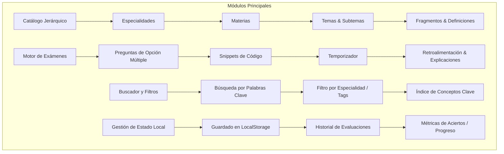
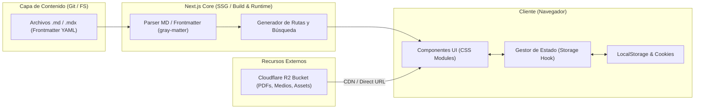

# Arquitectura del Sistema - EstudiosUniversitarios

Documento formal de especificación arquitectónica, diseño de componentes, modelo de datos y decisiones técnicas para la plataforma **EstudiosUniversitarios**.

---

## 1. Visión General y Objetivos

### 1.1. Propósito del Proyecto
**EstudiosUniversitarios** es una plataforma web orientada al aprendizaje autónomo y estructurado a nivel universitario. Permite a los estudiantes navegar por contenidos académicos organizados jerárquicamente, consultar definiciones teóricas y fragmentos clave, y evaluar su comprensión a través de un motor de exámenes interactivos con retroalimentación inmediata.

### 1.2. Objetivos Principales
- **Autonomía y Descentralización:** Funcionar de manera estática y ligera sin dependencia obligatoria de una base de datos central ni autenticación de usuarios.
- **Portabilidad del Contenido:** Mantener el contenido teórico, definiciones y bancos de preguntas en archivos Markdown/MDX versionados en el repositorio Git.
- **Rendimiento y Control de Estilos:** Utilizar componentes nativos con *CSS Modules* puros, garantizando un bundle ligero, legibilidad de código y diseño a medida sin sobrecarga de dependencias externas.
- **Escalabilidad de Recursos Pesados:** Delegar el almacenamiento y entrega de archivos multimedia/documentos pesados a *Cloudflare R2*.
- **Persistencia Local:** Registrar el progreso de estudio y los resultados de evaluaciones en el navegador del usuario (*LocalStorage* y *Cookies*).

---

## 2. Pila Tecnológica (Tech Stack)

| Capa / Rol | Tecnología | Justificación Técnica |
| :--- | :--- | :--- |
| **Framework Base** | [Next.js (App Router)](https://nextjs.org/) | Renderizado híbrido (SSG/SSR), optimización de rutas, alto rendimiento y soporte nativo de TypeScript. |
| **Lenguaje** | [TypeScript](https://www.typescriptlang.org/) | Tipado estático fuerte para esquemas de contenido, frontmatter, modelos de exámenes y tipado de estados locales. |
| **Estilos y UI** | CSS Modules (puro) | Modularidad de estilos, aislamiento de selectores (sin colisiones), cero dependencias de diseño externas y máxima claridad. |
| **Gestión de Contenido** | Markdown / MDX + YAML Frontmatter | Edición declarativa, fácil versionado en Git, soporte para código interactivo y metadatos estructurados. |
| **Almacenamiento de Archivos** | [Cloudflare R2](https://www.cloudflare.com/products/r2/) | Almacenamiento distribuido S3-compatible sin costos de egress, ideal para PDFs, diagramas de alta resolución y archivos pesados. |
| **Persistencia de Datos** | Browser Storage (*LocalStorage* + *Cookies*) | Almacenamiento en el cliente para historial de exámenes, puntuaciones y preferencias de estudio sin requerir base de datos. |
| **Despliegue / Hosting** | Vercel / Cloudflare Pages | Despliegue continuo (CI/CD), CDN global y edge computing para servir la aplicación estática/híbrida. |

---

## 3. Módulos y Funcionalidades del Sistema



### 3.1. Catálogo Jerárquico de Aprendizaje
Estructura organizada en cuatro niveles de profundidad:
1. **Especialidad:** Área de conocimiento o carrera (ej. *Ingeniería de Software*, *Ciencia de la Computación*).
2. **Materia:** Asignatura específica (ej. *Estructuras de Datos*, *Sistemas Operativos*).
3. **Tema:** Unidad de estudio dentro de la materia (ej. *Árboles Binarios*, *Gestión de Memoria*).
4. **Fragmentos y Definiciones:** Unidades atómicas de información, conceptos clave, sintaxis, ejemplos y enlaces a recursos pesados.

### 3.2. Motor de Exámenes Interactivos
- **Generación de Evaluaciones:** Carga de preguntas tipadas asociadas al tema seleccionado.
- **Tipos de Reactivos:** Opción múltiple, preguntas basadas en snippets de código y selección de respuestas técnicas.
- **Métricas y Control de Tiempo:** Temporizador configurable por examen y cálculo inmediato de puntuaciones.
- **Explicación Pedagógica:** Cada pregunta provee una justificación/solución detallada tras finalizar la prueba o por reactivo.

### 3.3. Buscador y Sistema de Filtrado
- Indexación estática en build-time de todos los títulos, tags, definiciones y conceptos.
- Búsqueda instantánea del lado del cliente con filtros combinables por especialidad, materia y etiquetas de dificultad.

### 3.4. Persistencia y Métricas en el Cliente
- Guardado local de los exámenes completados, fecha de realización, puntuación obtenida y respuestas falladas para posterior repaso.
- Sincronización transparente sin necesidad de registro o inicio de sesión.

---

## 4. Arquitectura de Software y Flujo de Datos



### 4.1. Capas del Sistema
1. **Capa de Contenido (Content Layer):** Almacenamiento estructurado en carpetas dentro de `/content` con archivos Markdown enriquecidos con metadatos.
2. **Capa de Procesamiento (Build/Server Layer):** Funciones de utilería en TypeScript (`lib/content.ts`) que leen los archivos físicos, extraen el frontmatter y exponen APIs tipadas para las páginas de Next.js.
3. **Capa de Presentación (UI Layer):** Componentes visuales autónomos desarrollados en React con estilos encapsulados vía `[Componente].module.css`.
4. **Capa de Persistencia (Client Storage Layer):** Hooks personalizados en React (`useExamStorage`, `useProgress`) para sincronizar el estado del usuario con el almacenamiento del navegador.
5. **Capa de Almacenamiento Externo (External Asset Layer):** URLs públicas o firmadas conectadas a Cloudflare R2 para servir recursos de gran peso sin saturar el repositorio ni exceder límites de bundle.

---

## 5. Estructura de Directorios Recomendada

```text
EstudiosUniversitarios/
├── content/                              # Fuentes de contenido en Markdown/MDX
│   └── especialidades/
│       └── ingenieria-software/
│           ├── metadata.json
│           └── estructuras-datos/
│               ├── tema-01-arboles.md
│               └── examen-arboles.md
├── public/                               # Assets estáticos locales (logos, favicons)
├── src/
│   ├── app/                              # Next.js App Router
│   │   ├── layout.tsx                    # Layout raíz global
│   │   ├── page.tsx                      # Página principal (Home / Catálogo)
│   │   ├── especialidades/
│   │   │   └── [especialidadSlug]/
│   │   │       ├── page.tsx
│   │   │       └── [materiaSlug]/
│   │   │           ├── page.tsx
│   │   │           └── [temaSlug]/
│   │   │               ├── page.tsx      # Vista de lectura de tema
│   │   │               └── examen/
│   │   │                   └── page.tsx  # Vista interactiva del examen
│   │   └── buscar/
│   │       └── page.tsx                  # Buscador global
│   ├── components/                       # Componentes modulares con CSS Modules
│   │   ├── common/                       # Header, Footer, Breadcrumb, Botones
│   │   │   ├── Header.tsx
│   │   │   └── Header.module.css
│   │   ├── content/                      # Renderizadores de Markdown, Fragmentos
│   │   │   ├── TopicViewer.tsx
│   │   │   └── TopicViewer.module.css
│   │   ├── exam/                         # Componentes del motor de exámenes
│   │   │   ├── ExamEngine.tsx
│   │   │   ├── ExamTimer.tsx
│   │   │   └── ExamEngine.module.css
│   │   └── search/                       # Barra de búsqueda y filtros
│   │       ├── SearchBar.tsx
│   │       └── SearchBar.module.css
│   ├── hooks/                            # Custom React Hooks
│   │   ├── useExamStorage.ts             # Sincronización con LocalStorage
│   │   └── useSearch.ts                  # Lógica de filtrado
│   ├── lib/                              # Utilidades y Procesamiento
│   │   ├── content.ts                    # Lectura y parsing de Markdown (gray-matter)
│   │   ├── r2.ts                         # Helpers para URLs y assets de Cloudflare R2
│   │   └── storage.ts                    # Wrapper seguro para LocalStorage / Cookies
│   ├── styles/                           # Variables globales y reset CSS
│   │   ├── globals.css                   # Tokens de diseño (colores, tipografía)
│   │   └── variables.module.css
│   └── types/                            # Tipado estricto en TypeScript
│       ├── content.ts                    # Interfaces de Temas, Materias y Especialidades
│       ├── exam.ts                       # Interfaces de Preguntas, Opciones y Resultados
│       └── storage.ts                    # Interfaces para el historial de progreso
├── .gitignore
├── ARCHITECTURE.md                       # Documento de arquitectura del sistema
├── next.config.mjs
├── package.json
├── README.md
└── tsconfig.json
```

---

## 6. Modelo de Datos y Tipos (TypeScript)

### 6.1. Esquema de Frontmatter para Temas (`types/content.ts`)
```typescript
export interface TopicFrontmatter {
  id: string;
  title: string;
  description: string;
  especialidad: string;
  materia: string;
  order: number;
  tags: string[];
  lastUpdated: string;
  externalAssets?: {
    label: string;
    r2Url: string;
    type: 'pdf' | 'dataset' | 'image';
  }[];
}
```

### 6.2. Esquema de Exámenes y Preguntas (`types/exam.ts`)
```typescript
export interface ExamQuestion {
  id: string;
  question: string;
  codeSnippet?: {
    language: string;
    code: string;
  };
  options: {
    id: string;
    text: string;
  }[];
  correctOptionId: string;
  explanation: string;
}

export interface ExamData {
  id: string;
  topicId: string;
  title: string;
  durationMinutes: number;
  passingScore: number;
  questions: ExamQuestion[];
}
```

### 6.3. Esquema de Persistencia Local (`types/storage.ts`)
```typescript
export interface ExamAttempt {
  attemptId: string;
  examId: string;
  topicId: string;
  date: string;
  score: number;
  totalQuestions: number;
  passed: boolean;
  selectedAnswers: Record<string, string>; // questionId -> optionId
}

export interface UserLocalProgress {
  completedTopics: string[]; // topicIds
  attempts: ExamAttempt[];
  preferences: {
    theme: 'light' | 'dark' | 'system';
    fontSize: 'normal' | 'large';
  };
}
```

---

## 7. Estrategia de Almacenamiento en Cloudflare R2

1. **Estructura del Bucket:**
   - `/assets/docs/[especialidad]/[materia]/guia-estudio.pdf`
   - `/assets/images/[tema]/diagrama-arquitectura.webp`
   - `/assets/datasets/[tema]/data.csv`
2. **Acceso y Entrega:**
   - Servidos a través de un dominio público personalizado configurado en Cloudflare (ej. `cdn.estudiosuniversitarios.dev/*` o `https://r2.miservidor.com/*`).
   - Caching optimizado en el Edge mediante Cloudflare CDN.

---

## 8. Principios de Diseño y Buenas Prácticas

- **Cero CSS-in-JS Runtime Overhead:** Uso exclusivo de CSS Modules procesados en tiempo de compilación.
- **Tipado Estricto (`strict: true`):** Garantizar que todas las estructuras de contenido Markdown y estados de la UI estén completamente cubiertos sin usar `any`.
- **Accesibilidad (a11y):** Componentes semánticos HTML5 con soporte para navegación por teclado y contraste adecuado.
- **Degradación Elegante:** La plataforma es 100% funcional en modo lectura incluso si el navegador tiene bloqueado el almacenamiento local.
